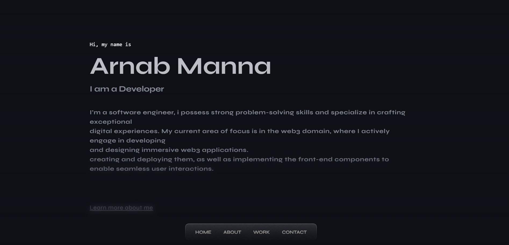

<p align="center">
  
</p>

# My Portfolio

Welcome to my portfolio website, showcasing my work and skills as a web developer. This portfolio is built using Next.js, TypeScript, JavaScript, React, and Framer Motion.

**Visit the live site**: [https://your-portfolio-url.com](https://your-portfolio-url.com)

## Table of Contents
- [About](#about)
- [Technologies Used](#technologies-used)
- [Getting Started](#getting-started)
- [Usage](#usage)
- [License](#license)
- [Contact](#contact)

## About

This portfolio serves as a showcase of my projects, skills, and experience as a web developer. It's designed to provide an overview of my capabilities and to help others learn more about me and my work.

## Technologies Used

- **Next.js**: A React framework for building server-rendered React applications.
- **TypeScript**: A typed superset of JavaScript that enhances code quality and developer productivity.
- **React**: A JavaScript library for building user interfaces.
- **Framer Motion**: A popular animation library for React applications.

## Getting Started

1. **Clone the repository:**
   ```bash
   git clone https://github.com/your-username/portfolio.git
2. **Navigate to the project directory:**
   ```bash
   cd portfolio

3. **Install the project dependencies:**
   ```bash
   npm install
     # or
   yarn install
4. **Start the development server:**
   ```bash
   npm run dev
     # or
   yarn dev
5. Open your web browser and visit http://localhost:3000 to view the portfolio.


## Usage

Feel free to use this portfolio as a template for your own portfolio. Replace the content and add your projects, skills, and information as needed. Customize the design and layout to suit your preferences.

## License

This project is licensed under the MIT License - see the LICENSE file for details.

## Contact

If you have any questions or would like to get in touch, you can find me on:

- **GitHub**: [`arnab-4`](https://github.com/arnab-4)
- **LinkedIn**: [`Arnab Manna`](https://www.linkedin.com/in/arnab-manna-442586240/)
- **Email**: `arnabmanna203@gmail.com`

Thank you for visiting my portfolio! 😊

```bash

In this updated version, I've added an introductory image, improved formatting, added a live site link, and provided a "Contact" section for users to reach out to you. Be sure to replace `arnab-4`, `https://arnab-portfolio-swart.vercel.app/`, `arnabmanna203@gmail.com`, and other placeholders with your actual information and links. You can also customize the styling further using HTML and CSS within your README if desired.

